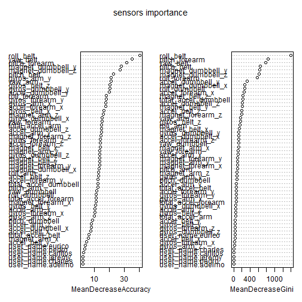

Human Activity Recognition
================================
Note: This analysis was created on a Mac.

## Preliminaries


### Load libraries/data/create new variables


```r
setwd("C:\\Data\\Coursera\\predmachlearn-002\\programm_assigment\\predmachlearn-002")

## load data:
pml <- read.csv("data\\pml-training.csv", na.strings = c("", "NA", "#DIV/0!"))
pml.submit <- read.csv("data\\pml-testing.csv", na.strings = c("", "NA", "#DIV/0!"))

### prepare data set for submition: set the same type for some features
pml.submit$new_window <- factor(pml.submit$new_window, levels(pml$new_window))
pml.submit$cvtd_timestamp <- factor(pml.submit$cvtd_timestamp, levels(pml$cvtd_timestamp))
```


##  Exploration and data cleaning


### explorations 

```r
summary(pml)
```

```
##        X            user_name    raw_timestamp_part_1 raw_timestamp_part_2
##  Min.   :    1   adelmo  :3892   Min.   :1.32e+09     Min.   :   294      
##  1st Qu.: 4906   carlitos:3112   1st Qu.:1.32e+09     1st Qu.:252912      
##  Median : 9812   charles :3536   Median :1.32e+09     Median :496380      
##  Mean   : 9812   eurico  :3070   Mean   :1.32e+09     Mean   :500656      
##  3rd Qu.:14717   jeremy  :3402   3rd Qu.:1.32e+09     3rd Qu.:751891      
##  Max.   :19622   pedro   :2610   Max.   :1.32e+09     Max.   :998801      
##                                                                           
##           cvtd_timestamp  new_window    num_window    roll_belt    
##  28/11/2011 14:14: 1498   no :19216   Min.   :  1   Min.   :-28.9  
##  05/12/2011 11:24: 1497   yes:  406   1st Qu.:222   1st Qu.:  1.1  
##  30/11/2011 17:11: 1440               Median :424   Median :113.0  
##  05/12/2011 11:25: 1425               Mean   :431   Mean   : 64.4  
##  02/12/2011 14:57: 1380               3rd Qu.:644   3rd Qu.:123.0  
##  02/12/2011 13:34: 1375               Max.   :864   Max.   :162.0  
##  (Other)         :11007                                            
##    pitch_belt        yaw_belt      total_accel_belt kurtosis_roll_belt
##  Min.   :-55.80   Min.   :-180.0   Min.   : 0.0     Min.   :-2        
##  1st Qu.:  1.76   1st Qu.: -88.3   1st Qu.: 3.0     1st Qu.:-1        
##  Median :  5.28   Median : -13.0   Median :17.0     Median :-1        
##  Mean   :  0.31   Mean   : -11.2   Mean   :11.3     Mean   : 0        
##  3rd Qu.: 14.90   3rd Qu.:  12.9   3rd Qu.:18.0     3rd Qu.: 0        
##  Max.   : 60.30   Max.   : 179.0   Max.   :29.0     Max.   :33        
##                                                     NA's   :19226     
##  kurtosis_picth_belt kurtosis_yaw_belt skewness_roll_belt
##  Min.   :-2          Mode:logical      Min.   :-6        
##  1st Qu.:-1          NA's:19622        1st Qu.: 0        
##  Median : 0                            Median : 0        
##  Mean   : 4                            Mean   : 0        
##  3rd Qu.: 3                            3rd Qu.: 0        
##  Max.   :58                            Max.   : 4        
##  NA's   :19248                         NA's   :19225     
##  skewness_roll_belt.1 skewness_yaw_belt max_roll_belt   max_picth_belt 
##  Min.   :-8           Mode:logical      Min.   :-94     Min.   : 3     
##  1st Qu.:-1           NA's:19622        1st Qu.:-88     1st Qu.: 5     
##  Median : 0                             Median : -5     Median :18     
##  Mean   : 0                             Mean   : -7     Mean   :13     
##  3rd Qu.: 1                             3rd Qu.: 18     3rd Qu.:19     
##  Max.   : 7                             Max.   :180     Max.   :30     
##  NA's   :19248                          NA's   :19216   NA's   :19216  
##   max_yaw_belt   min_roll_belt   min_pitch_belt   min_yaw_belt  
##  Min.   :-2      Min.   :-180    Min.   : 0      Min.   :-2     
##  1st Qu.:-1      1st Qu.: -88    1st Qu.: 3      1st Qu.:-1     
##  Median :-1      Median :  -8    Median :16      Median :-1     
##  Mean   : 0      Mean   : -10    Mean   :11      Mean   : 0     
##  3rd Qu.: 0      3rd Qu.:   9    3rd Qu.:17      3rd Qu.: 0     
##  Max.   :33      Max.   : 173    Max.   :23      Max.   :33     
##  NA's   :19226   NA's   :19216   NA's   :19216   NA's   :19226  
##  amplitude_roll_belt amplitude_pitch_belt amplitude_yaw_belt
##  Min.   :  0         Min.   : 0           Min.   :0         
##  1st Qu.:  0         1st Qu.: 1           1st Qu.:0         
##  Median :  1         Median : 1           Median :0         
##  Mean   :  4         Mean   : 2           Mean   :0         
##  3rd Qu.:  2         3rd Qu.: 2           3rd Qu.:0         
##  Max.   :360         Max.   :12           Max.   :0         
##  NA's   :19216       NA's   :19216        NA's   :19226     
##  var_total_accel_belt avg_roll_belt   stddev_roll_belt var_roll_belt  
##  Min.   : 0           Min.   :-27     Min.   : 0       Min.   :  0    
##  1st Qu.: 0           1st Qu.:  1     1st Qu.: 0       1st Qu.:  0    
##  Median : 0           Median :116     Median : 0       Median :  0    
##  Mean   : 1           Mean   : 68     Mean   : 1       Mean   :  8    
##  3rd Qu.: 0           3rd Qu.:123     3rd Qu.: 1       3rd Qu.:  0    
##  Max.   :16           Max.   :157     Max.   :14       Max.   :201    
##  NA's   :19216        NA's   :19216   NA's   :19216    NA's   :19216  
##  avg_pitch_belt  stddev_pitch_belt var_pitch_belt   avg_yaw_belt  
##  Min.   :-51     Min.   :0         Min.   : 0      Min.   :-138   
##  1st Qu.:  2     1st Qu.:0         1st Qu.: 0      1st Qu.: -88   
##  Median :  5     Median :0         Median : 0      Median :  -7   
##  Mean   :  1     Mean   :1         Mean   : 1      Mean   :  -9   
##  3rd Qu.: 16     3rd Qu.:1         3rd Qu.: 0      3rd Qu.:  14   
##  Max.   : 60     Max.   :4         Max.   :16      Max.   : 174   
##  NA's   :19216   NA's   :19216     NA's   :19216   NA's   :19216  
##  stddev_yaw_belt  var_yaw_belt    gyros_belt_x      gyros_belt_y    
##  Min.   :  0     Min.   :    0   Min.   :-1.0400   Min.   :-0.6400  
##  1st Qu.:  0     1st Qu.:    0   1st Qu.:-0.0300   1st Qu.: 0.0000  
##  Median :  0     Median :    0   Median : 0.0300   Median : 0.0200  
##  Mean   :  1     Mean   :  107   Mean   :-0.0056   Mean   : 0.0396  
##  3rd Qu.:  1     3rd Qu.:    0   3rd Qu.: 0.1100   3rd Qu.: 0.1100  
##  Max.   :177     Max.   :31183   Max.   : 2.2200   Max.   : 0.6400  
##  NA's   :19216   NA's   :19216                                      
##   gyros_belt_z     accel_belt_x      accel_belt_y    accel_belt_z   
##  Min.   :-1.460   Min.   :-120.00   Min.   :-69.0   Min.   :-275.0  
##  1st Qu.:-0.200   1st Qu.: -21.00   1st Qu.:  3.0   1st Qu.:-162.0  
##  Median :-0.100   Median : -15.00   Median : 35.0   Median :-152.0  
##  Mean   :-0.130   Mean   :  -5.59   Mean   : 30.1   Mean   : -72.6  
##  3rd Qu.:-0.020   3rd Qu.:  -5.00   3rd Qu.: 61.0   3rd Qu.:  27.0  
##  Max.   : 1.620   Max.   :  85.00   Max.   :164.0   Max.   : 105.0  
##                                                                     
##  magnet_belt_x   magnet_belt_y magnet_belt_z     roll_arm     
##  Min.   :-52.0   Min.   :354   Min.   :-623   Min.   :-180.0  
##  1st Qu.:  9.0   1st Qu.:581   1st Qu.:-375   1st Qu.: -31.8  
##  Median : 35.0   Median :601   Median :-320   Median :   0.0  
##  Mean   : 55.6   Mean   :594   Mean   :-346   Mean   :  17.8  
##  3rd Qu.: 59.0   3rd Qu.:610   3rd Qu.:-306   3rd Qu.:  77.3  
##  Max.   :485.0   Max.   :673   Max.   : 293   Max.   : 180.0  
##                                                               
##    pitch_arm         yaw_arm        total_accel_arm var_accel_arm  
##  Min.   :-88.80   Min.   :-180.00   Min.   : 1.0    Min.   :  0    
##  1st Qu.:-25.90   1st Qu.: -43.10   1st Qu.:17.0    1st Qu.:  9    
##  Median :  0.00   Median :   0.00   Median :27.0    Median : 41    
##  Mean   : -4.61   Mean   :  -0.62   Mean   :25.5    Mean   : 53    
##  3rd Qu.: 11.20   3rd Qu.:  45.88   3rd Qu.:33.0    3rd Qu.: 76    
##  Max.   : 88.50   Max.   : 180.00   Max.   :66.0    Max.   :332    
##                                                     NA's   :19216  
##   avg_roll_arm   stddev_roll_arm  var_roll_arm   avg_pitch_arm  
##  Min.   :-167    Min.   :  0     Min.   :    0   Min.   :-82    
##  1st Qu.: -38    1st Qu.:  1     1st Qu.:    2   1st Qu.:-23    
##  Median :   0    Median :  6     Median :   33   Median :  0    
##  Mean   :  13    Mean   : 11     Mean   :  417   Mean   : -5    
##  3rd Qu.:  76    3rd Qu.: 15     3rd Qu.:  223   3rd Qu.:  8    
##  Max.   : 163    Max.   :162     Max.   :26232   Max.   : 76    
##  NA's   :19216   NA's   :19216   NA's   :19216   NA's   :19216  
##  stddev_pitch_arm var_pitch_arm    avg_yaw_arm    stddev_yaw_arm 
##  Min.   : 0       Min.   :   0    Min.   :-173    Min.   :  0    
##  1st Qu.: 2       1st Qu.:   3    1st Qu.: -29    1st Qu.:  3    
##  Median : 8       Median :  66    Median :   0    Median : 17    
##  Mean   :10       Mean   : 196    Mean   :   2    Mean   : 22    
##  3rd Qu.:16       3rd Qu.: 267    3rd Qu.:  38    3rd Qu.: 36    
##  Max.   :43       Max.   :1885    Max.   : 152    Max.   :177    
##  NA's   :19216    NA's   :19216   NA's   :19216   NA's   :19216  
##   var_yaw_arm     gyros_arm_x      gyros_arm_y      gyros_arm_z   
##  Min.   :    0   Min.   :-6.370   Min.   :-3.440   Min.   :-2.33  
##  1st Qu.:    7   1st Qu.:-1.330   1st Qu.:-0.800   1st Qu.:-0.07  
##  Median :  278   Median : 0.080   Median :-0.240   Median : 0.23  
##  Mean   : 1056   Mean   : 0.043   Mean   :-0.257   Mean   : 0.27  
##  3rd Qu.: 1295   3rd Qu.: 1.570   3rd Qu.: 0.140   3rd Qu.: 0.72  
##  Max.   :31345   Max.   : 4.870   Max.   : 2.840   Max.   : 3.02  
##  NA's   :19216                                                    
##   accel_arm_x      accel_arm_y      accel_arm_z      magnet_arm_x 
##  Min.   :-404.0   Min.   :-318.0   Min.   :-636.0   Min.   :-584  
##  1st Qu.:-242.0   1st Qu.: -54.0   1st Qu.:-143.0   1st Qu.:-300  
##  Median : -44.0   Median :  14.0   Median : -47.0   Median : 289  
##  Mean   : -60.2   Mean   :  32.6   Mean   : -71.2   Mean   : 192  
##  3rd Qu.:  84.0   3rd Qu.: 139.0   3rd Qu.:  23.0   3rd Qu.: 637  
##  Max.   : 437.0   Max.   : 308.0   Max.   : 292.0   Max.   : 782  
##                                                                   
##   magnet_arm_y   magnet_arm_z  kurtosis_roll_arm kurtosis_picth_arm
##  Min.   :-392   Min.   :-597   Min.   :-2        Min.   :-2        
##  1st Qu.:  -9   1st Qu.: 131   1st Qu.:-1        1st Qu.:-1        
##  Median : 202   Median : 444   Median :-1        Median :-1        
##  Mean   : 157   Mean   : 306   Mean   : 0        Mean   :-1        
##  3rd Qu.: 323   3rd Qu.: 545   3rd Qu.: 0        3rd Qu.: 0        
##  Max.   : 583   Max.   : 694   Max.   :21        Max.   :20        
##                                NA's   :19294     NA's   :19296     
##  kurtosis_yaw_arm skewness_roll_arm skewness_pitch_arm skewness_yaw_arm
##  Min.   :-2       Min.   :-3        Min.   :-5         Min.   :-7      
##  1st Qu.:-1       1st Qu.:-1        1st Qu.:-1         1st Qu.:-1      
##  Median :-1       Median : 0        Median : 0         Median : 0      
##  Mean   : 0       Mean   : 0        Mean   : 0         Mean   : 0      
##  3rd Qu.: 0       3rd Qu.: 1        3rd Qu.: 0         3rd Qu.: 0      
##  Max.   :56       Max.   : 4        Max.   : 3         Max.   : 7      
##  NA's   :19227    NA's   :19293     NA's   :19296      NA's   :19227   
##   max_roll_arm   max_picth_arm    max_yaw_arm     min_roll_arm  
##  Min.   :-73     Min.   :-173    Min.   : 4      Min.   :-89    
##  1st Qu.:  0     1st Qu.:  -2    1st Qu.:29      1st Qu.:-42    
##  Median :  5     Median :  23    Median :34      Median :-22    
##  Mean   : 11     Mean   :  36    Mean   :35      Mean   :-21    
##  3rd Qu.: 27     3rd Qu.:  96    3rd Qu.:41      3rd Qu.:  0    
##  Max.   : 86     Max.   : 180    Max.   :65      Max.   : 66    
##  NA's   :19216   NA's   :19216   NA's   :19216   NA's   :19216  
##  min_pitch_arm    min_yaw_arm    amplitude_roll_arm amplitude_pitch_arm
##  Min.   :-180    Min.   : 1      Min.   :  0        Min.   :  0        
##  1st Qu.: -73    1st Qu.: 8      1st Qu.:  5        1st Qu.: 10        
##  Median : -34    Median :13      Median : 28        Median : 55        
##  Mean   : -34    Mean   :15      Mean   : 32        Mean   : 70        
##  3rd Qu.:   0    3rd Qu.:19      3rd Qu.: 51        3rd Qu.:115        
##  Max.   : 152    Max.   :38      Max.   :120        Max.   :360        
##  NA's   :19216   NA's   :19216   NA's   :19216      NA's   :19216      
##  amplitude_yaw_arm roll_dumbbell    pitch_dumbbell    yaw_dumbbell    
##  Min.   : 0        Min.   :-153.7   Min.   :-149.6   Min.   :-150.87  
##  1st Qu.:13        1st Qu.: -18.5   1st Qu.: -40.9   1st Qu.: -77.64  
##  Median :22        Median :  48.2   Median : -21.0   Median :  -3.32  
##  Mean   :21        Mean   :  23.8   Mean   : -10.8   Mean   :   1.67  
##  3rd Qu.:29        3rd Qu.:  67.6   3rd Qu.:  17.5   3rd Qu.:  79.64  
##  Max.   :52        Max.   : 153.6   Max.   : 149.4   Max.   : 154.95  
##  NA's   :19216                                                        
##  kurtosis_roll_dumbbell kurtosis_picth_dumbbell kurtosis_yaw_dumbbell
##  Min.   :-2             Min.   :-2              Mode:logical         
##  1st Qu.:-1             1st Qu.:-1              NA's:19622           
##  Median : 0             Median : 0                                   
##  Mean   : 0             Mean   : 0                                   
##  3rd Qu.: 1             3rd Qu.: 1                                   
##  Max.   :55             Max.   :56                                   
##  NA's   :19221          NA's   :19218                                
##  skewness_roll_dumbbell skewness_pitch_dumbbell skewness_yaw_dumbbell
##  Min.   :-7             Min.   :-7              Mode:logical         
##  1st Qu.:-1             1st Qu.:-1              NA's:19622           
##  Median : 0             Median : 0                                   
##  Mean   : 0             Mean   : 0                                   
##  3rd Qu.: 0             3rd Qu.: 1                                   
##  Max.   : 2             Max.   : 4                                   
##  NA's   :19220          NA's   :19217                                
##  max_roll_dumbbell max_picth_dumbbell max_yaw_dumbbell min_roll_dumbbell
##  Min.   :-70       Min.   :-113       Min.   :-2       Min.   :-150     
##  1st Qu.:-27       1st Qu.: -67       1st Qu.:-1       1st Qu.: -60     
##  Median : 15       Median :  40       Median : 0       Median : -44     
##  Mean   : 14       Mean   :  33       Mean   : 0       Mean   : -41     
##  3rd Qu.: 51       3rd Qu.: 133       3rd Qu.: 1       3rd Qu.: -25     
##  Max.   :137       Max.   : 155       Max.   :55       Max.   :  73     
##  NA's   :19216     NA's   :19216      NA's   :19221    NA's   :19216    
##  min_pitch_dumbbell min_yaw_dumbbell amplitude_roll_dumbbell
##  Min.   :-147       Min.   :-2       Min.   :  0            
##  1st Qu.: -92       1st Qu.:-1       1st Qu.: 15            
##  Median : -66       Median : 0       Median : 35            
##  Mean   : -33       Mean   : 0       Mean   : 55            
##  3rd Qu.:  21       3rd Qu.: 1       3rd Qu.: 81            
##  Max.   : 121       Max.   :55       Max.   :256            
##  NA's   :19216      NA's   :19221    NA's   :19216          
##  amplitude_pitch_dumbbell amplitude_yaw_dumbbell total_accel_dumbbell
##  Min.   :  0              Min.   :0              Min.   : 0.0        
##  1st Qu.: 17              1st Qu.:0              1st Qu.: 4.0        
##  Median : 42              Median :0              Median :10.0        
##  Mean   : 66              Mean   :0              Mean   :13.7        
##  3rd Qu.:100              3rd Qu.:0              3rd Qu.:19.0        
##  Max.   :274              Max.   :0              Max.   :58.0        
##  NA's   :19216            NA's   :19221                              
##  var_accel_dumbbell avg_roll_dumbbell stddev_roll_dumbbell
##  Min.   :  0        Min.   :-129      Min.   :  0         
##  1st Qu.:  0        1st Qu.: -12      1st Qu.:  5         
##  Median :  1        Median :  48      Median : 12         
##  Mean   :  4        Mean   :  24      Mean   : 21         
##  3rd Qu.:  3        3rd Qu.:  64      3rd Qu.: 26         
##  Max.   :230        Max.   : 126      Max.   :124         
##  NA's   :19216      NA's   :19216     NA's   :19216       
##  var_roll_dumbbell avg_pitch_dumbbell stddev_pitch_dumbbell
##  Min.   :    0     Min.   :-71        Min.   : 0           
##  1st Qu.:   22     1st Qu.:-42        1st Qu.: 3           
##  Median :  149     Median :-20        Median : 8           
##  Mean   : 1020     Mean   :-12        Mean   :13           
##  3rd Qu.:  695     3rd Qu.: 13        3rd Qu.:19           
##  Max.   :15321     Max.   : 94        Max.   :83           
##  NA's   :19216     NA's   :19216      NA's   :19216        
##  var_pitch_dumbbell avg_yaw_dumbbell stddev_yaw_dumbbell var_yaw_dumbbell
##  Min.   :   0       Min.   :-118     Min.   :  0         Min.   :    0   
##  1st Qu.:  12       1st Qu.: -77     1st Qu.:  4         1st Qu.:   15   
##  Median :  65       Median :  -5     Median : 10         Median :  105   
##  Mean   : 350       Mean   :   0     Mean   : 17         Mean   :  590   
##  3rd Qu.: 370       3rd Qu.:  71     3rd Qu.: 25         3rd Qu.:  609   
##  Max.   :6836       Max.   : 135     Max.   :107         Max.   :11468   
##  NA's   :19216      NA's   :19216    NA's   :19216       NA's   :19216   
##  gyros_dumbbell_x  gyros_dumbbell_y gyros_dumbbell_z accel_dumbbell_x
##  Min.   :-204.00   Min.   :-2.10    Min.   : -2.4    Min.   :-419.0  
##  1st Qu.:  -0.03   1st Qu.:-0.14    1st Qu.: -0.3    1st Qu.: -50.0  
##  Median :   0.13   Median : 0.03    Median : -0.1    Median :  -8.0  
##  Mean   :   0.16   Mean   : 0.05    Mean   : -0.1    Mean   : -28.6  
##  3rd Qu.:   0.35   3rd Qu.: 0.21    3rd Qu.:  0.0    3rd Qu.:  11.0  
##  Max.   :   2.22   Max.   :52.00    Max.   :317.0    Max.   : 235.0  
##                                                                      
##  accel_dumbbell_y accel_dumbbell_z magnet_dumbbell_x magnet_dumbbell_y
##  Min.   :-189.0   Min.   :-334.0   Min.   :-643      Min.   :-3600    
##  1st Qu.:  -8.0   1st Qu.:-142.0   1st Qu.:-535      1st Qu.:  231    
##  Median :  41.5   Median :  -1.0   Median :-479      Median :  311    
##  Mean   :  52.6   Mean   : -38.3   Mean   :-328      Mean   :  221    
##  3rd Qu.: 111.0   3rd Qu.:  38.0   3rd Qu.:-304      3rd Qu.:  390    
##  Max.   : 315.0   Max.   : 318.0   Max.   : 592      Max.   :  633    
##                                                                       
##  magnet_dumbbell_z  roll_forearm     pitch_forearm     yaw_forearm    
##  Min.   :-262.0    Min.   :-180.00   Min.   :-72.50   Min.   :-180.0  
##  1st Qu.: -45.0    1st Qu.:  -0.74   1st Qu.:  0.00   1st Qu.: -68.6  
##  Median :  13.0    Median :  21.70   Median :  9.24   Median :   0.0  
##  Mean   :  46.1    Mean   :  33.83   Mean   : 10.71   Mean   :  19.2  
##  3rd Qu.:  95.0    3rd Qu.: 140.00   3rd Qu.: 28.40   3rd Qu.: 110.0  
##  Max.   : 452.0    Max.   : 180.00   Max.   : 89.80   Max.   : 180.0  
##                                                                       
##  kurtosis_roll_forearm kurtosis_picth_forearm kurtosis_yaw_forearm
##  Min.   :-2            Min.   :-2             Mode:logical        
##  1st Qu.:-1            1st Qu.:-1             NA's:19622          
##  Median :-1            Median :-1                                 
##  Mean   :-1            Mean   : 0                                 
##  3rd Qu.:-1            3rd Qu.: 0                                 
##  Max.   :40            Max.   :34                                 
##  NA's   :19300         NA's   :19301                              
##  skewness_roll_forearm skewness_pitch_forearm skewness_yaw_forearm
##  Min.   :-2            Min.   :-5             Mode:logical        
##  1st Qu.: 0            1st Qu.:-1             NA's:19622          
##  Median : 0            Median : 0                                 
##  Mean   : 0            Mean   : 0                                 
##  3rd Qu.: 0            3rd Qu.: 1                                 
##  Max.   : 6            Max.   : 4                                 
##  NA's   :19299         NA's   :19301                              
##  max_roll_forearm max_picth_forearm max_yaw_forearm min_roll_forearm
##  Min.   :-67      Min.   :-151      Min.   :-2      Min.   :-72     
##  1st Qu.:  0      1st Qu.:   0      1st Qu.:-1      1st Qu.: -6     
##  Median : 27      Median : 113      Median :-1      Median :  0     
##  Mean   : 24      Mean   :  81      Mean   :-1      Mean   :  0     
##  3rd Qu.: 46      3rd Qu.: 175      3rd Qu.:-1      3rd Qu.: 12     
##  Max.   : 90      Max.   : 180      Max.   :40      Max.   : 62     
##  NA's   :19216    NA's   :19216     NA's   :19300   NA's   :19216   
##  min_pitch_forearm min_yaw_forearm amplitude_roll_forearm
##  Min.   :-180      Min.   :-2      Min.   :  0           
##  1st Qu.:-175      1st Qu.:-1      1st Qu.:  1           
##  Median : -61      Median :-1      Median : 18           
##  Mean   : -58      Mean   :-1      Mean   : 25           
##  3rd Qu.:   0      3rd Qu.:-1      3rd Qu.: 40           
##  Max.   : 167      Max.   :40      Max.   :126           
##  NA's   :19216     NA's   :19300   NA's   :19216         
##  amplitude_pitch_forearm amplitude_yaw_forearm total_accel_forearm
##  Min.   :  0             Min.   :0             Min.   :  0.0      
##  1st Qu.:  2             1st Qu.:0             1st Qu.: 29.0      
##  Median : 84             Median :0             Median : 36.0      
##  Mean   :139             Mean   :0             Mean   : 34.7      
##  3rd Qu.:350             3rd Qu.:0             3rd Qu.: 41.0      
##  Max.   :360             Max.   :0             Max.   :108.0      
##  NA's   :19216           NA's   :19300                            
##  var_accel_forearm avg_roll_forearm stddev_roll_forearm var_roll_forearm
##  Min.   :  0       Min.   :-177     Min.   :  0         Min.   :    0   
##  1st Qu.:  7       1st Qu.:  -1     1st Qu.:  0         1st Qu.:    0   
##  Median : 21       Median :  11     Median :  8         Median :   64   
##  Mean   : 34       Mean   :  33     Mean   : 42         Mean   : 5274   
##  3rd Qu.: 51       3rd Qu.: 107     3rd Qu.: 85         3rd Qu.: 7289   
##  Max.   :173       Max.   : 177     Max.   :179         Max.   :32102   
##  NA's   :19216     NA's   :19216    NA's   :19216       NA's   :19216   
##  avg_pitch_forearm stddev_pitch_forearm var_pitch_forearm avg_yaw_forearm
##  Min.   :-68       Min.   : 0           Min.   :   0      Min.   :-155   
##  1st Qu.:  0       1st Qu.: 0           1st Qu.:   0      1st Qu.: -26   
##  Median : 12       Median : 6           Median :  30      Median :   0   
##  Mean   : 12       Mean   : 8           Mean   : 140      Mean   :  18   
##  3rd Qu.: 28       3rd Qu.:13           3rd Qu.: 166      3rd Qu.:  86   
##  Max.   : 72       Max.   :48           Max.   :2280      Max.   : 169   
##  NA's   :19216     NA's   :19216        NA's   :19216     NA's   :19216  
##  stddev_yaw_forearm var_yaw_forearm gyros_forearm_x   gyros_forearm_y 
##  Min.   :  0        Min.   :    0   Min.   :-22.000   Min.   : -7.02  
##  1st Qu.:  1        1st Qu.:    0   1st Qu.: -0.220   1st Qu.: -1.46  
##  Median : 25        Median :  612   Median :  0.050   Median :  0.03  
##  Mean   : 45        Mean   : 4640   Mean   :  0.158   Mean   :  0.08  
##  3rd Qu.: 86        3rd Qu.: 7368   3rd Qu.:  0.560   3rd Qu.:  1.62  
##  Max.   :198        Max.   :39009   Max.   :  3.970   Max.   :311.00  
##  NA's   :19216      NA's   :19216                                     
##  gyros_forearm_z  accel_forearm_x  accel_forearm_y accel_forearm_z 
##  Min.   : -8.09   Min.   :-498.0   Min.   :-632    Min.   :-446.0  
##  1st Qu.: -0.18   1st Qu.:-178.0   1st Qu.:  57    1st Qu.:-182.0  
##  Median :  0.08   Median : -57.0   Median : 201    Median : -39.0  
##  Mean   :  0.15   Mean   : -61.7   Mean   : 164    Mean   : -55.3  
##  3rd Qu.:  0.49   3rd Qu.:  76.0   3rd Qu.: 312    3rd Qu.:  26.0  
##  Max.   :231.00   Max.   : 477.0   Max.   : 923    Max.   : 291.0  
##                                                                    
##  magnet_forearm_x magnet_forearm_y magnet_forearm_z classe  
##  Min.   :-1280    Min.   :-896     Min.   :-973     A:5580  
##  1st Qu.: -616    1st Qu.:   2     1st Qu.: 191     B:3797  
##  Median : -378    Median : 591     Median : 511     C:3422  
##  Mean   : -313    Mean   : 380     Mean   : 394     D:3216  
##  3rd Qu.:  -73    3rd Qu.: 737     3rd Qu.: 653     E:3607  
##  Max.   :  672    Max.   :1480     Max.   :1090             
## 
```

We can see, that we have a lot of columns with moslty NA values
 find not sparsed columns, with at least 10% not NA values:

```r
not.sparsed.features <- apply(pml, 2, function(x) {
    mean(is.na(x))
}) < 0.1
names(pml)[not.sparsed.features]
```

```
##  [1] "X"                    "user_name"            "raw_timestamp_part_1"
##  [4] "raw_timestamp_part_2" "cvtd_timestamp"       "new_window"          
##  [7] "num_window"           "roll_belt"            "pitch_belt"          
## [10] "yaw_belt"             "total_accel_belt"     "gyros_belt_x"        
## [13] "gyros_belt_y"         "gyros_belt_z"         "accel_belt_x"        
## [16] "accel_belt_y"         "accel_belt_z"         "magnet_belt_x"       
## [19] "magnet_belt_y"        "magnet_belt_z"        "roll_arm"            
## [22] "pitch_arm"            "yaw_arm"              "total_accel_arm"     
## [25] "gyros_arm_x"          "gyros_arm_y"          "gyros_arm_z"         
## [28] "accel_arm_x"          "accel_arm_y"          "accel_arm_z"         
## [31] "magnet_arm_x"         "magnet_arm_y"         "magnet_arm_z"        
## [34] "roll_dumbbell"        "pitch_dumbbell"       "yaw_dumbbell"        
## [37] "total_accel_dumbbell" "gyros_dumbbell_x"     "gyros_dumbbell_y"    
## [40] "gyros_dumbbell_z"     "accel_dumbbell_x"     "accel_dumbbell_y"    
## [43] "accel_dumbbell_z"     "magnet_dumbbell_x"    "magnet_dumbbell_y"   
## [46] "magnet_dumbbell_z"    "roll_forearm"         "pitch_forearm"       
## [49] "yaw_forearm"          "total_accel_forearm"  "gyros_forearm_x"     
## [52] "gyros_forearm_y"      "gyros_forearm_z"      "accel_forearm_x"     
## [55] "accel_forearm_y"      "accel_forearm_z"      "magnet_forearm_x"    
## [58] "magnet_forearm_y"     "magnet_forearm_z"     "classe"
```


check again count of NA for not.sparsed.features:
 it's ok if sum = 0

```r
sum(apply(pml[, not.sparsed.features], 2, function(x) {
    mean(is.na(x))
}))
```

```
## [1] 0
```


heck that the dataset for submition this column also have all NA values.
it's ok if sum = 0

```r
sum(!is.na(pml.submit[, !not.sparsed.features]))
```

```
## [1] 0
```


in fact it not obligatiry to exlude all NA features for some algorithm (random forest,decision tree), we can just replace NA to some abnormal value  and get the same result, but it will takes some more time.

looks again at the not sparsed data:

```r
summary(pml[, not.sparsed.features])
```

```
##        X            user_name    raw_timestamp_part_1 raw_timestamp_part_2
##  Min.   :    1   adelmo  :3892   Min.   :1.32e+09     Min.   :   294      
##  1st Qu.: 4906   carlitos:3112   1st Qu.:1.32e+09     1st Qu.:252912      
##  Median : 9812   charles :3536   Median :1.32e+09     Median :496380      
##  Mean   : 9812   eurico  :3070   Mean   :1.32e+09     Mean   :500656      
##  3rd Qu.:14717   jeremy  :3402   3rd Qu.:1.32e+09     3rd Qu.:751891      
##  Max.   :19622   pedro   :2610   Max.   :1.32e+09     Max.   :998801      
##                                                                           
##           cvtd_timestamp  new_window    num_window    roll_belt    
##  28/11/2011 14:14: 1498   no :19216   Min.   :  1   Min.   :-28.9  
##  05/12/2011 11:24: 1497   yes:  406   1st Qu.:222   1st Qu.:  1.1  
##  30/11/2011 17:11: 1440               Median :424   Median :113.0  
##  05/12/2011 11:25: 1425               Mean   :431   Mean   : 64.4  
##  02/12/2011 14:57: 1380               3rd Qu.:644   3rd Qu.:123.0  
##  02/12/2011 13:34: 1375               Max.   :864   Max.   :162.0  
##  (Other)         :11007                                            
##    pitch_belt        yaw_belt      total_accel_belt  gyros_belt_x    
##  Min.   :-55.80   Min.   :-180.0   Min.   : 0.0     Min.   :-1.0400  
##  1st Qu.:  1.76   1st Qu.: -88.3   1st Qu.: 3.0     1st Qu.:-0.0300  
##  Median :  5.28   Median : -13.0   Median :17.0     Median : 0.0300  
##  Mean   :  0.31   Mean   : -11.2   Mean   :11.3     Mean   :-0.0056  
##  3rd Qu.: 14.90   3rd Qu.:  12.9   3rd Qu.:18.0     3rd Qu.: 0.1100  
##  Max.   : 60.30   Max.   : 179.0   Max.   :29.0     Max.   : 2.2200  
##                                                                      
##   gyros_belt_y      gyros_belt_z     accel_belt_x      accel_belt_y  
##  Min.   :-0.6400   Min.   :-1.460   Min.   :-120.00   Min.   :-69.0  
##  1st Qu.: 0.0000   1st Qu.:-0.200   1st Qu.: -21.00   1st Qu.:  3.0  
##  Median : 0.0200   Median :-0.100   Median : -15.00   Median : 35.0  
##  Mean   : 0.0396   Mean   :-0.130   Mean   :  -5.59   Mean   : 30.1  
##  3rd Qu.: 0.1100   3rd Qu.:-0.020   3rd Qu.:  -5.00   3rd Qu.: 61.0  
##  Max.   : 0.6400   Max.   : 1.620   Max.   :  85.00   Max.   :164.0  
##                                                                      
##   accel_belt_z    magnet_belt_x   magnet_belt_y magnet_belt_z 
##  Min.   :-275.0   Min.   :-52.0   Min.   :354   Min.   :-623  
##  1st Qu.:-162.0   1st Qu.:  9.0   1st Qu.:581   1st Qu.:-375  
##  Median :-152.0   Median : 35.0   Median :601   Median :-320  
##  Mean   : -72.6   Mean   : 55.6   Mean   :594   Mean   :-346  
##  3rd Qu.:  27.0   3rd Qu.: 59.0   3rd Qu.:610   3rd Qu.:-306  
##  Max.   : 105.0   Max.   :485.0   Max.   :673   Max.   : 293  
##                                                               
##     roll_arm        pitch_arm         yaw_arm        total_accel_arm
##  Min.   :-180.0   Min.   :-88.80   Min.   :-180.00   Min.   : 1.0   
##  1st Qu.: -31.8   1st Qu.:-25.90   1st Qu.: -43.10   1st Qu.:17.0   
##  Median :   0.0   Median :  0.00   Median :   0.00   Median :27.0   
##  Mean   :  17.8   Mean   : -4.61   Mean   :  -0.62   Mean   :25.5   
##  3rd Qu.:  77.3   3rd Qu.: 11.20   3rd Qu.:  45.88   3rd Qu.:33.0   
##  Max.   : 180.0   Max.   : 88.50   Max.   : 180.00   Max.   :66.0   
##                                                                     
##   gyros_arm_x      gyros_arm_y      gyros_arm_z     accel_arm_x    
##  Min.   :-6.370   Min.   :-3.440   Min.   :-2.33   Min.   :-404.0  
##  1st Qu.:-1.330   1st Qu.:-0.800   1st Qu.:-0.07   1st Qu.:-242.0  
##  Median : 0.080   Median :-0.240   Median : 0.23   Median : -44.0  
##  Mean   : 0.043   Mean   :-0.257   Mean   : 0.27   Mean   : -60.2  
##  3rd Qu.: 1.570   3rd Qu.: 0.140   3rd Qu.: 0.72   3rd Qu.:  84.0  
##  Max.   : 4.870   Max.   : 2.840   Max.   : 3.02   Max.   : 437.0  
##                                                                    
##   accel_arm_y      accel_arm_z      magnet_arm_x   magnet_arm_y 
##  Min.   :-318.0   Min.   :-636.0   Min.   :-584   Min.   :-392  
##  1st Qu.: -54.0   1st Qu.:-143.0   1st Qu.:-300   1st Qu.:  -9  
##  Median :  14.0   Median : -47.0   Median : 289   Median : 202  
##  Mean   :  32.6   Mean   : -71.2   Mean   : 192   Mean   : 157  
##  3rd Qu.: 139.0   3rd Qu.:  23.0   3rd Qu.: 637   3rd Qu.: 323  
##  Max.   : 308.0   Max.   : 292.0   Max.   : 782   Max.   : 583  
##                                                                 
##   magnet_arm_z  roll_dumbbell    pitch_dumbbell    yaw_dumbbell    
##  Min.   :-597   Min.   :-153.7   Min.   :-149.6   Min.   :-150.87  
##  1st Qu.: 131   1st Qu.: -18.5   1st Qu.: -40.9   1st Qu.: -77.64  
##  Median : 444   Median :  48.2   Median : -21.0   Median :  -3.32  
##  Mean   : 306   Mean   :  23.8   Mean   : -10.8   Mean   :   1.67  
##  3rd Qu.: 545   3rd Qu.:  67.6   3rd Qu.:  17.5   3rd Qu.:  79.64  
##  Max.   : 694   Max.   : 153.6   Max.   : 149.4   Max.   : 154.95  
##                                                                    
##  total_accel_dumbbell gyros_dumbbell_x  gyros_dumbbell_y gyros_dumbbell_z
##  Min.   : 0.0         Min.   :-204.00   Min.   :-2.10    Min.   : -2.4   
##  1st Qu.: 4.0         1st Qu.:  -0.03   1st Qu.:-0.14    1st Qu.: -0.3   
##  Median :10.0         Median :   0.13   Median : 0.03    Median : -0.1   
##  Mean   :13.7         Mean   :   0.16   Mean   : 0.05    Mean   : -0.1   
##  3rd Qu.:19.0         3rd Qu.:   0.35   3rd Qu.: 0.21    3rd Qu.:  0.0   
##  Max.   :58.0         Max.   :   2.22   Max.   :52.00    Max.   :317.0   
##                                                                          
##  accel_dumbbell_x accel_dumbbell_y accel_dumbbell_z magnet_dumbbell_x
##  Min.   :-419.0   Min.   :-189.0   Min.   :-334.0   Min.   :-643     
##  1st Qu.: -50.0   1st Qu.:  -8.0   1st Qu.:-142.0   1st Qu.:-535     
##  Median :  -8.0   Median :  41.5   Median :  -1.0   Median :-479     
##  Mean   : -28.6   Mean   :  52.6   Mean   : -38.3   Mean   :-328     
##  3rd Qu.:  11.0   3rd Qu.: 111.0   3rd Qu.:  38.0   3rd Qu.:-304     
##  Max.   : 235.0   Max.   : 315.0   Max.   : 318.0   Max.   : 592     
##                                                                      
##  magnet_dumbbell_y magnet_dumbbell_z  roll_forearm     pitch_forearm   
##  Min.   :-3600     Min.   :-262.0    Min.   :-180.00   Min.   :-72.50  
##  1st Qu.:  231     1st Qu.: -45.0    1st Qu.:  -0.74   1st Qu.:  0.00  
##  Median :  311     Median :  13.0    Median :  21.70   Median :  9.24  
##  Mean   :  221     Mean   :  46.1    Mean   :  33.83   Mean   : 10.71  
##  3rd Qu.:  390     3rd Qu.:  95.0    3rd Qu.: 140.00   3rd Qu.: 28.40  
##  Max.   :  633     Max.   : 452.0    Max.   : 180.00   Max.   : 89.80  
##                                                                        
##   yaw_forearm     total_accel_forearm gyros_forearm_x   gyros_forearm_y 
##  Min.   :-180.0   Min.   :  0.0       Min.   :-22.000   Min.   : -7.02  
##  1st Qu.: -68.6   1st Qu.: 29.0       1st Qu.: -0.220   1st Qu.: -1.46  
##  Median :   0.0   Median : 36.0       Median :  0.050   Median :  0.03  
##  Mean   :  19.2   Mean   : 34.7       Mean   :  0.158   Mean   :  0.08  
##  3rd Qu.: 110.0   3rd Qu.: 41.0       3rd Qu.:  0.560   3rd Qu.:  1.62  
##  Max.   : 180.0   Max.   :108.0       Max.   :  3.970   Max.   :311.00  
##                                                                         
##  gyros_forearm_z  accel_forearm_x  accel_forearm_y accel_forearm_z 
##  Min.   : -8.09   Min.   :-498.0   Min.   :-632    Min.   :-446.0  
##  1st Qu.: -0.18   1st Qu.:-178.0   1st Qu.:  57    1st Qu.:-182.0  
##  Median :  0.08   Median : -57.0   Median : 201    Median : -39.0  
##  Mean   :  0.15   Mean   : -61.7   Mean   : 164    Mean   : -55.3  
##  3rd Qu.:  0.49   3rd Qu.:  76.0   3rd Qu.: 312    3rd Qu.:  26.0  
##  Max.   :231.00   Max.   : 477.0   Max.   : 923    Max.   : 291.0  
##                                                                    
##  magnet_forearm_x magnet_forearm_y magnet_forearm_z classe  
##  Min.   :-1280    Min.   :-896     Min.   :-973     A:5580  
##  1st Qu.: -616    1st Qu.:   2     1st Qu.: 191     B:3797  
##  Median : -378    Median : 591     Median : 511     C:3422  
##  Mean   : -313    Mean   : 380     Mean   : 394     D:3216  
##  3rd Qu.:  -73    3rd Qu.: 737     3rd Qu.: 653     E:3607  
##  Max.   :  672    Max.   :1480     Max.   :1090             
## 
```

```r
head(pml[, not.sparsed.features])
```

```
##   X user_name raw_timestamp_part_1 raw_timestamp_part_2   cvtd_timestamp
## 1 1  carlitos           1323084231               788290 05/12/2011 11:23
## 2 2  carlitos           1323084231               808298 05/12/2011 11:23
## 3 3  carlitos           1323084231               820366 05/12/2011 11:23
## 4 4  carlitos           1323084232               120339 05/12/2011 11:23
## 5 5  carlitos           1323084232               196328 05/12/2011 11:23
## 6 6  carlitos           1323084232               304277 05/12/2011 11:23
##   new_window num_window roll_belt pitch_belt yaw_belt total_accel_belt
## 1         no         11      1.41       8.07    -94.4                3
## 2         no         11      1.41       8.07    -94.4                3
## 3         no         11      1.42       8.07    -94.4                3
## 4         no         12      1.48       8.05    -94.4                3
## 5         no         12      1.48       8.07    -94.4                3
## 6         no         12      1.45       8.06    -94.4                3
##   gyros_belt_x gyros_belt_y gyros_belt_z accel_belt_x accel_belt_y
## 1         0.00         0.00        -0.02          -21            4
## 2         0.02         0.00        -0.02          -22            4
## 3         0.00         0.00        -0.02          -20            5
## 4         0.02         0.00        -0.03          -22            3
## 5         0.02         0.02        -0.02          -21            2
## 6         0.02         0.00        -0.02          -21            4
##   accel_belt_z magnet_belt_x magnet_belt_y magnet_belt_z roll_arm
## 1           22            -3           599          -313     -128
## 2           22            -7           608          -311     -128
## 3           23            -2           600          -305     -128
## 4           21            -6           604          -310     -128
## 5           24            -6           600          -302     -128
## 6           21             0           603          -312     -128
##   pitch_arm yaw_arm total_accel_arm gyros_arm_x gyros_arm_y gyros_arm_z
## 1      22.5    -161              34        0.00        0.00       -0.02
## 2      22.5    -161              34        0.02       -0.02       -0.02
## 3      22.5    -161              34        0.02       -0.02       -0.02
## 4      22.1    -161              34        0.02       -0.03        0.02
## 5      22.1    -161              34        0.00       -0.03        0.00
## 6      22.0    -161              34        0.02       -0.03        0.00
##   accel_arm_x accel_arm_y accel_arm_z magnet_arm_x magnet_arm_y
## 1        -288         109        -123         -368          337
## 2        -290         110        -125         -369          337
## 3        -289         110        -126         -368          344
## 4        -289         111        -123         -372          344
## 5        -289         111        -123         -374          337
## 6        -289         111        -122         -369          342
##   magnet_arm_z roll_dumbbell pitch_dumbbell yaw_dumbbell
## 1          516         13.05         -70.49       -84.87
## 2          513         13.13         -70.64       -84.71
## 3          513         12.85         -70.28       -85.14
## 4          512         13.43         -70.39       -84.87
## 5          506         13.38         -70.43       -84.85
## 6          513         13.38         -70.82       -84.47
##   total_accel_dumbbell gyros_dumbbell_x gyros_dumbbell_y gyros_dumbbell_z
## 1                   37                0            -0.02             0.00
## 2                   37                0            -0.02             0.00
## 3                   37                0            -0.02             0.00
## 4                   37                0            -0.02            -0.02
## 5                   37                0            -0.02             0.00
## 6                   37                0            -0.02             0.00
##   accel_dumbbell_x accel_dumbbell_y accel_dumbbell_z magnet_dumbbell_x
## 1             -234               47             -271              -559
## 2             -233               47             -269              -555
## 3             -232               46             -270              -561
## 4             -232               48             -269              -552
## 5             -233               48             -270              -554
## 6             -234               48             -269              -558
##   magnet_dumbbell_y magnet_dumbbell_z roll_forearm pitch_forearm
## 1               293               -65         28.4         -63.9
## 2               296               -64         28.3         -63.9
## 3               298               -63         28.3         -63.9
## 4               303               -60         28.1         -63.9
## 5               292               -68         28.0         -63.9
## 6               294               -66         27.9         -63.9
##   yaw_forearm total_accel_forearm gyros_forearm_x gyros_forearm_y
## 1        -153                  36            0.03            0.00
## 2        -153                  36            0.02            0.00
## 3        -152                  36            0.03           -0.02
## 4        -152                  36            0.02           -0.02
## 5        -152                  36            0.02            0.00
## 6        -152                  36            0.02           -0.02
##   gyros_forearm_z accel_forearm_x accel_forearm_y accel_forearm_z
## 1           -0.02             192             203            -215
## 2           -0.02             192             203            -216
## 3            0.00             196             204            -213
## 4            0.00             189             206            -214
## 5           -0.02             189             206            -214
## 6           -0.03             193             203            -215
##   magnet_forearm_x magnet_forearm_y magnet_forearm_z classe
## 1              -17              654              476      A
## 2              -18              661              473      A
## 3              -18              658              469      A
## 4              -16              658              469      A
## 5              -17              655              473      A
## 6               -9              660              478      A
```

check have we  all personalized data values (user_name) both in the source data set and in the submition dataset

```r
table(pml$user_name, pml$classe)
```

```
##           
##               A    B    C    D    E
##   adelmo   1165  776  750  515  686
##   carlitos  834  690  493  486  609
##   charles   899  745  539  642  711
##   eurico    865  592  489  582  542
##   jeremy   1177  489  652  522  562
##   pedro     640  505  499  469  497
```

```r
table(pml.submit$user_name)
```

```
## 
##   adelmo carlitos  charles   eurico   jeremy    pedro 
##        1        3        1        4        8        3
```

**so we can use user_name column for submition and analysis**

to process analysis for unpersonal data we shoul have new persons data in the test dataset

## Leackage variables analysis
variables X, timestampls num windows are looks like leakage features. Let's validate it

```r
leakageFeaturesInd <- c(3, 4, 5, 6, 7)  # timestamps and others  are leakage  features. 
names(pml[, leakageFeaturesInd])
```

```
## [1] "raw_timestamp_part_1" "raw_timestamp_part_2" "cvtd_timestamp"      
## [4] "new_window"           "num_window"
```


to evaluate models create data partitions:


```r
library(caret)
```

```
## Warning: package 'caret' was built under R version 3.0.3
```

```
## Loading required package: lattice
## Loading required package: ggplot2
```

```
## Warning: package 'ggplot2' was built under R version 3.0.3
```

```r
inTrain <- createDataPartition(y = pml$classe, p = 0.7, list = FALSE)
```


```r
leakageFeaturesInd_WithClass <- c(leakageFeaturesInd, c(160))
names(pml)[leakageFeaturesInd_WithClass]
```

```
## [1] "raw_timestamp_part_1" "raw_timestamp_part_2" "cvtd_timestamp"      
## [4] "new_window"           "num_window"           "classe"
```

```r
training.leakage <- pml[inTrain, leakageFeaturesInd_WithClass]
testing.leakage <- pml[-inTrain, leakageFeaturesInd_WithClass]

dummies <- dummyVars(~., data = rbind(pml[, leakageFeaturesInd], pml.submit[, 
    leakageFeaturesInd]))


training.leakage <- data.frame(classe = training.leakage$classe, predict(dummies, 
    newdata = training.leakage))
testing.leakage <- data.frame(classe = testing.leakage$classe, predict(dummies, 
    newdata = testing.leakage))
pml.submit.leackage <- pml.submit[, leakageFeaturesInd]
pml.submit.leackage <- data.frame(predict(dummies, newdata = pml.submit.leackage))
names(training.leakage)
```

```
##  [1] "classe"                          "raw_timestamp_part_1"           
##  [3] "raw_timestamp_part_2"            "cvtd_timestamp.02.12.2011.13.32"
##  [5] "cvtd_timestamp.02.12.2011.13.33" "cvtd_timestamp.02.12.2011.13.34"
##  [7] "cvtd_timestamp.02.12.2011.13.35" "cvtd_timestamp.02.12.2011.14.56"
##  [9] "cvtd_timestamp.02.12.2011.14.57" "cvtd_timestamp.02.12.2011.14.58"
## [11] "cvtd_timestamp.02.12.2011.14.59" "cvtd_timestamp.05.12.2011.11.23"
## [13] "cvtd_timestamp.05.12.2011.11.24" "cvtd_timestamp.05.12.2011.11.25"
## [15] "cvtd_timestamp.05.12.2011.14.22" "cvtd_timestamp.05.12.2011.14.23"
## [17] "cvtd_timestamp.05.12.2011.14.24" "cvtd_timestamp.28.11.2011.14.13"
## [19] "cvtd_timestamp.28.11.2011.14.14" "cvtd_timestamp.28.11.2011.14.15"
## [21] "cvtd_timestamp.30.11.2011.17.10" "cvtd_timestamp.30.11.2011.17.11"
## [23] "cvtd_timestamp.30.11.2011.17.12" "new_window.no"                  
## [25] "new_window.yes"                  "num_window"
```

```r
names(testing.leakage)
```

```
##  [1] "classe"                          "raw_timestamp_part_1"           
##  [3] "raw_timestamp_part_2"            "cvtd_timestamp.02.12.2011.13.32"
##  [5] "cvtd_timestamp.02.12.2011.13.33" "cvtd_timestamp.02.12.2011.13.34"
##  [7] "cvtd_timestamp.02.12.2011.13.35" "cvtd_timestamp.02.12.2011.14.56"
##  [9] "cvtd_timestamp.02.12.2011.14.57" "cvtd_timestamp.02.12.2011.14.58"
## [11] "cvtd_timestamp.02.12.2011.14.59" "cvtd_timestamp.05.12.2011.11.23"
## [13] "cvtd_timestamp.05.12.2011.11.24" "cvtd_timestamp.05.12.2011.11.25"
## [15] "cvtd_timestamp.05.12.2011.14.22" "cvtd_timestamp.05.12.2011.14.23"
## [17] "cvtd_timestamp.05.12.2011.14.24" "cvtd_timestamp.28.11.2011.14.13"
## [19] "cvtd_timestamp.28.11.2011.14.14" "cvtd_timestamp.28.11.2011.14.15"
## [21] "cvtd_timestamp.30.11.2011.17.10" "cvtd_timestamp.30.11.2011.17.11"
## [23] "cvtd_timestamp.30.11.2011.17.12" "new_window.no"                  
## [25] "new_window.yes"                  "num_window"
```

```r
names(pml.submit.leackage)
```

```
##  [1] "raw_timestamp_part_1"            "raw_timestamp_part_2"           
##  [3] "cvtd_timestamp.02.12.2011.13.32" "cvtd_timestamp.02.12.2011.13.33"
##  [5] "cvtd_timestamp.02.12.2011.13.34" "cvtd_timestamp.02.12.2011.13.35"
##  [7] "cvtd_timestamp.02.12.2011.14.56" "cvtd_timestamp.02.12.2011.14.57"
##  [9] "cvtd_timestamp.02.12.2011.14.58" "cvtd_timestamp.02.12.2011.14.59"
## [11] "cvtd_timestamp.05.12.2011.11.23" "cvtd_timestamp.05.12.2011.11.24"
## [13] "cvtd_timestamp.05.12.2011.11.25" "cvtd_timestamp.05.12.2011.14.22"
## [15] "cvtd_timestamp.05.12.2011.14.23" "cvtd_timestamp.05.12.2011.14.24"
## [17] "cvtd_timestamp.28.11.2011.14.13" "cvtd_timestamp.28.11.2011.14.14"
## [19] "cvtd_timestamp.28.11.2011.14.15" "cvtd_timestamp.30.11.2011.17.10"
## [21] "cvtd_timestamp.30.11.2011.17.11" "cvtd_timestamp.30.11.2011.17.12"
## [23] "new_window.no"                   "new_window.yes"                 
## [25] "num_window"
```

```r

modFit.leakage <- train(as.factor(classe) ~ ., method = "rf", ntree = 100, data = training.leakage, 
    trControl = trainControl(method = "cv", number = 4, returnResamp = "all", 
        verboseIter = TRUE))
```

```
## Loading required package: randomForest
## randomForest 4.6-7
## Type rfNews() to see new features/changes/bug fixes.
## Loading required package: class
```

```
## + Fold1: mtry= 2 
## - Fold1: mtry= 2 
## + Fold1: mtry=13 
## - Fold1: mtry=13 
## + Fold1: mtry=25 
## - Fold1: mtry=25 
## + Fold2: mtry= 2 
## - Fold2: mtry= 2 
## + Fold2: mtry=13 
## - Fold2: mtry=13 
## + Fold2: mtry=25 
## - Fold2: mtry=25 
## + Fold3: mtry= 2 
## - Fold3: mtry= 2 
## + Fold3: mtry=13 
## - Fold3: mtry=13 
## + Fold3: mtry=25 
## - Fold3: mtry=25 
## + Fold4: mtry= 2 
## - Fold4: mtry= 2 
## + Fold4: mtry=13 
## - Fold4: mtry=13 
## + Fold4: mtry=25 
## - Fold4: mtry=25 
## Aggregating results
## Selecting tuning parameters
## Fitting mtry = 25 on full training set
```

```r

rf.model.leakage <- modFit.leakage$finalModel


predictions.leakage <- predict(rf.model.leakage, newdata = testing.leakage)
table(predictions.leakage)
```

```
## predictions.leakage
##    A    B    C    D    E 
## 1674 1137 1028  965 1081
```

```r
confusionMatrix(predictions.leakage, testing.leakage$classe)
```

```
## Confusion Matrix and Statistics
## 
##           Reference
## Prediction    A    B    C    D    E
##          A 1674    0    0    0    0
##          B    0 1137    0    0    0
##          C    0    2 1026    0    0
##          D    0    0    0  964    1
##          E    0    0    0    0 1081
## 
## Overall Statistics
##                                     
##                Accuracy : 0.999     
##                  95% CI : (0.999, 1)
##     No Information Rate : 0.284     
##     P-Value [Acc > NIR] : <2e-16    
##                                     
##                   Kappa : 0.999     
##  Mcnemar's Test P-Value : NA        
## 
## Statistics by Class:
## 
##                      Class: A Class: B Class: C Class: D Class: E
## Sensitivity             1.000    0.998    1.000    1.000    0.999
## Specificity             1.000    1.000    1.000    1.000    1.000
## Pos Pred Value          1.000    1.000    0.998    0.999    1.000
## Neg Pred Value          1.000    1.000    1.000    1.000    1.000
## Prevalence              0.284    0.194    0.174    0.164    0.184
## Detection Rate          0.284    0.193    0.174    0.164    0.184
## Detection Prevalence    0.284    0.193    0.175    0.164    0.184
## Balanced Accuracy       1.000    0.999    1.000    1.000    1.000
```

```r
prediction.submit.leakage <- predict(rf.model.leakage, newdata = pml.submit.leackage)
prediction.submit.leakage
```

```
##  1  2  3  4  5  6  7  8  9 10 11 12 13 14 15 16 17 18 19 20 
##  B  A  B  A  A  E  D  B  A  A  B  C  B  A  E  E  A  B  B  B 
## Levels: A B C D E
```

**So, we have Accuracy = 99.95 % without using any measures from sensors, so it's seems we have 5 columns with information leakage. Exlude them**
And remember prediction for 20 rows for submitting to compare later with "honest" model result

## Predictabilty analysis
to evaluate models create data partitions:

```r
inTrain <- createDataPartition(y = pml$classe, p = 0.7, list = FALSE)
```


prepare cleared features vector, removing X column, leackage features and sparsed column

```r
t <- rep(TRUE, dim(pml)[2])
t[leakageFeaturesInd] <- FALSE  # remove leakage features
t[1] <- FALSE  # remove X column 

cleared.features <- t & not.sparsed.features
```

result features vector :

```r
table(cleared.features)
```

```
## cleared.features
## FALSE  TRUE 
##   106    54
```

```r
names(pml[, cleared.features])
```

```
##  [1] "user_name"            "roll_belt"            "pitch_belt"          
##  [4] "yaw_belt"             "total_accel_belt"     "gyros_belt_x"        
##  [7] "gyros_belt_y"         "gyros_belt_z"         "accel_belt_x"        
## [10] "accel_belt_y"         "accel_belt_z"         "magnet_belt_x"       
## [13] "magnet_belt_y"        "magnet_belt_z"        "roll_arm"            
## [16] "pitch_arm"            "yaw_arm"              "total_accel_arm"     
## [19] "gyros_arm_x"          "gyros_arm_y"          "gyros_arm_z"         
## [22] "accel_arm_x"          "accel_arm_y"          "accel_arm_z"         
## [25] "magnet_arm_x"         "magnet_arm_y"         "magnet_arm_z"        
## [28] "roll_dumbbell"        "pitch_dumbbell"       "yaw_dumbbell"        
## [31] "total_accel_dumbbell" "gyros_dumbbell_x"     "gyros_dumbbell_y"    
## [34] "gyros_dumbbell_z"     "accel_dumbbell_x"     "accel_dumbbell_y"    
## [37] "accel_dumbbell_z"     "magnet_dumbbell_x"    "magnet_dumbbell_y"   
## [40] "magnet_dumbbell_z"    "roll_forearm"         "pitch_forearm"       
## [43] "yaw_forearm"          "total_accel_forearm"  "gyros_forearm_x"     
## [46] "gyros_forearm_y"      "gyros_forearm_z"      "accel_forearm_x"     
## [49] "accel_forearm_y"      "accel_forearm_z"      "magnet_forearm_x"    
## [52] "magnet_forearm_y"     "magnet_forearm_z"     "classe"
```


Prepare training and testing data set:

```r
training <- pml[inTrain, cleared.features]
testing <- pml[-inTrain, cleared.features]
cleared.features.withoutLast <- cleared.features
cleared.features.withoutLast[160] <- FALSE
# treat user_name factor
dummies <- dummyVars(~., data = rbind(pml[, cleared.features.withoutLast], pml.submit[, 
    cleared.features.withoutLast]))

training <- data.frame(classe = training$classe, predict(dummies, newdata = training))
testing <- data.frame(classe = testing$classe, predict(dummies, newdata = testing))
names(training)
```

```
##  [1] "classe"               "user_name.adelmo"     "user_name.carlitos"  
##  [4] "user_name.charles"    "user_name.eurico"     "user_name.jeremy"    
##  [7] "user_name.pedro"      "roll_belt"            "pitch_belt"          
## [10] "yaw_belt"             "total_accel_belt"     "gyros_belt_x"        
## [13] "gyros_belt_y"         "gyros_belt_z"         "accel_belt_x"        
## [16] "accel_belt_y"         "accel_belt_z"         "magnet_belt_x"       
## [19] "magnet_belt_y"        "magnet_belt_z"        "roll_arm"            
## [22] "pitch_arm"            "yaw_arm"              "total_accel_arm"     
## [25] "gyros_arm_x"          "gyros_arm_y"          "gyros_arm_z"         
## [28] "accel_arm_x"          "accel_arm_y"          "accel_arm_z"         
## [31] "magnet_arm_x"         "magnet_arm_y"         "magnet_arm_z"        
## [34] "roll_dumbbell"        "pitch_dumbbell"       "yaw_dumbbell"        
## [37] "total_accel_dumbbell" "gyros_dumbbell_x"     "gyros_dumbbell_y"    
## [40] "gyros_dumbbell_z"     "accel_dumbbell_x"     "accel_dumbbell_y"    
## [43] "accel_dumbbell_z"     "magnet_dumbbell_x"    "magnet_dumbbell_y"   
## [46] "magnet_dumbbell_z"    "roll_forearm"         "pitch_forearm"       
## [49] "yaw_forearm"          "total_accel_forearm"  "gyros_forearm_x"     
## [52] "gyros_forearm_y"      "gyros_forearm_z"      "accel_forearm_x"     
## [55] "accel_forearm_y"      "accel_forearm_z"      "magnet_forearm_x"    
## [58] "magnet_forearm_y"     "magnet_forearm_z"
```

```r

dim(training)
```

```
## [1] 13737    59
```

```r
dim(testing)
```

```
## [1] 5885   59
```


We have not any suggestion about linearity, so use high accuracy method for non-linear data Random Forest

```r
modFit <- train(as.factor(classe) ~ ., method = "rf", ntree = 100, data = training, 
    importance = TRUE, trControl = trainControl(method = "cv", number = 4, returnResamp = "all", 
        verboseIter = TRUE))
```

```
## + Fold1: mtry= 2 
## - Fold1: mtry= 2 
## + Fold1: mtry=30 
## - Fold1: mtry=30 
## + Fold1: mtry=58 
## - Fold1: mtry=58 
## + Fold2: mtry= 2 
## - Fold2: mtry= 2 
## + Fold2: mtry=30 
## - Fold2: mtry=30 
## + Fold2: mtry=58 
## - Fold2: mtry=58 
## + Fold3: mtry= 2 
## - Fold3: mtry= 2 
## + Fold3: mtry=30 
## - Fold3: mtry=30 
## + Fold3: mtry=58 
## - Fold3: mtry=58 
## + Fold4: mtry= 2 
## - Fold4: mtry= 2 
## + Fold4: mtry=30 
## - Fold4: mtry=30 
## + Fold4: mtry=58 
## - Fold4: mtry=58 
## Aggregating results
## Selecting tuning parameters
## Fitting mtry = 30 on full training set
```

```r
## it takes 4*2 execution of randomForest algorithm

rf.model <- modFit$finalModel

predictions <- predict(rf.model, newdata = testing)
table(predictions)
```

```
## predictions
##    A    B    C    D    E 
## 1686 1131 1030  962 1076
```

```r
confusionMatrix(predictions, testing$classe)
```

```
## Confusion Matrix and Statistics
## 
##           Reference
## Prediction    A    B    C    D    E
##          A 1673   13    0    0    0
##          B    1 1125    5    0    0
##          C    0    1 1017   10    2
##          D    0    0    4  954    4
##          E    0    0    0    0 1076
## 
## Overall Statistics
##                                         
##                Accuracy : 0.993         
##                  95% CI : (0.991, 0.995)
##     No Information Rate : 0.284         
##     P-Value [Acc > NIR] : <2e-16        
##                                         
##                   Kappa : 0.991         
##  Mcnemar's Test P-Value : NA            
## 
## Statistics by Class:
## 
##                      Class: A Class: B Class: C Class: D Class: E
## Sensitivity             0.999    0.988    0.991    0.990    0.994
## Specificity             0.997    0.999    0.997    0.998    1.000
## Pos Pred Value          0.992    0.995    0.987    0.992    1.000
## Neg Pred Value          1.000    0.997    0.998    0.998    0.999
## Prevalence              0.284    0.194    0.174    0.164    0.184
## Detection Rate          0.284    0.191    0.173    0.162    0.183
## Detection Prevalence    0.286    0.192    0.175    0.163    0.183
## Balanced Accuracy       0.998    0.993    0.994    0.994    0.997
```

```r

importance <- data.frame(rf.model$importance)
importance.ordered <- importance[order(-importance$MeanDecreaseAccuracy), ]
```


```r
varImpPlot(rf.model, n.var = nrow(rf.model$importance), main = "sensors importance")
```

 

## Conclusion
We can achive 99.3% Accuracy for already tested person.
We have 7 mostly importance sensors and can cheap the sensors kit

## generate submition


```r
## generate submitions:
pml.submit.transformed <- pml.submit[, cleared.features.withoutLast]
pml.submit.transformed <- data.frame(predict(dummies, newdata = pml.submit.transformed))

prediction.submit <- predict(rf.model, newdata = pml.submit.transformed)
prediction.submit
```

```
##  1  2  3  4  5  6  7  8  9 10 11 12 13 14 15 16 17 18 19 20 
##  B  A  B  A  A  E  D  B  A  A  B  C  B  A  E  E  A  B  B  B 
## Levels: A B C D E
```

```r

# compare result with leakage prediction:
prediction.submit.leakage
```

```
##  1  2  3  4  5  6  7  8  9 10 11 12 13 14 15 16 17 18 19 20 
##  B  A  B  A  A  E  D  B  A  A  B  C  B  A  E  E  A  B  B  B 
## Levels: A B C D E
```

```r


###### generate submition files

answers = as.character(prediction.submit)

pml_write_files = function(x) {
    n = length(x)
    for (i in 1:n) {
        filename = paste0("problem_id_", i, ".txt")
        write.table(x[i], file = filename, quote = FALSE, row.names = FALSE, 
            col.names = FALSE)
    }
}
pml_write_files(answers)
```


